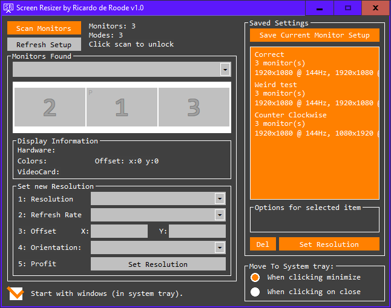
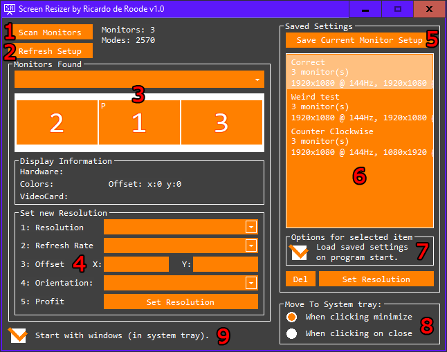

# ScreenResizer

Are you sick of changing the resolution of your multimonitor setup back to the right settings everytime you start your pc? Well, me too!

I wrote this program to help people to auto correct their display resolution settings when windows starts. This program is written in a timespan of around 3 days.

# Why would you need this program?
- You need to change your resolution, orientation, refreshrate or offset frequently and consistently.
- You have multiple monitors that lose their settings at random boots. (single monitor setups are welcome too :))

# The program itself

This program has the following features:
- Change individual monitors quickly with the built-in controls.
- Add/save your current setup as a profile and restore to that profile at a later time.
- Select a profile to be applied when the program starts.
- Start with windows (in the system tray).
- Preview of the saved profiles on mouse-over.

# How to use
The screenshot below has numbers on certain parts of the program. Here is a explanation of every part:

1. Click this button to scan all attached monitors and their resolution modes. This might take a while on high-end multiple monitor setups.
2. A refresh button for the visual representation of the displays. Use this if you changed the a display resolution setting with a different program.
3. Select a display you want to change. You can select from the dropdown menu or by clicking on the squares with a number in it. The 'P' stands for Primary Monitor.
4. A tool to help you set the correct display settings for the selected display. Is only needed when creating a profile.
5. If all your displays are at their correct settings, use this button to save the current setup.
6. You can mouse-over this list to view what the result is of this profile. Double-clicking on an item in the list triggers the loading of this profile.
7. If you select a profile you can check this box to activate this profile when the program starts.
8. For convenience, this program can minimize to the system tray if you need the profiles quickly. You can hide the program in the system tray by clicking the minimize button or, if preferred, by clicking the close button.
9. Start the program with windows. This might need Administrative rights because it uses the registry to change this.

**TIP:** You dont need the numbers 1, 2, 3 and 4. If all your displays are at the right settings already, just click the save (5), select the profile (6) and check the checkmark (7) to activate the profile when the program starts. Last but not least, select (7) to start with windows.

